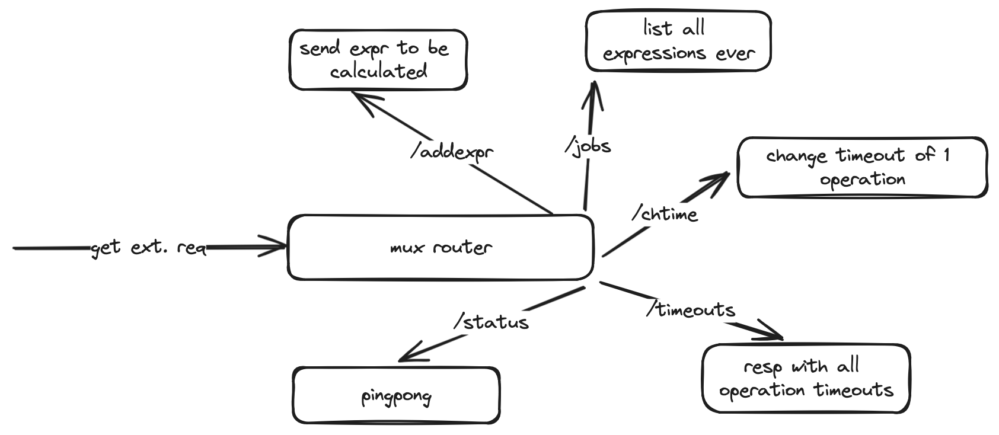
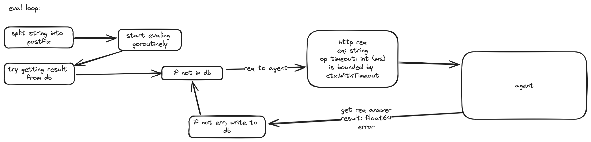
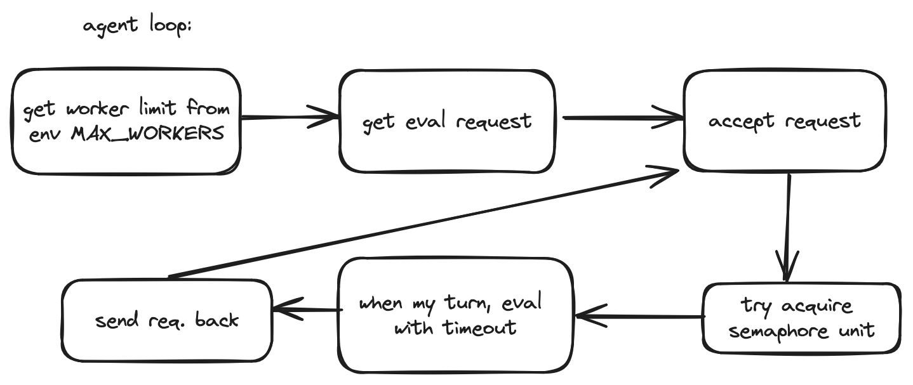

# rvav
Has 2 entities: agent and orchestrator. Orchestrator splits equations, agent calculates. By default orchestrator launches on :8080, agent on :8081

# Installation
```sh
git clone https://github.com/wdmvv/rvav
cd rvav
# building agent
cd agent
go get && go build
# building orchestrator
cd ../orchestrator
go get && go build
# you'll get 2 binaries - agent and orchestrator
```
You'll also need psql running. Just set it up and make it work.<br>
After setting everything up, fill in /config/orchestrator.json with your data on everything<br>
To launch:
```sh
# first you need agent running
./agent/agent
# and then orchestrator
./orchestrator/orchestrator
```

# "How does this work?"
If I did not change anything these are orchestrator endpoints, visualized. Up-to-date endpoints [here](/docs/orch.md)

Eval loop, i.e how does it calculate stuff

And agent


More detailed info on each(endpoints, structure and for what):<br>
[For agent](/docs/agent.md)<br>
[For orchestrator](/docs/orch.md)<br>

