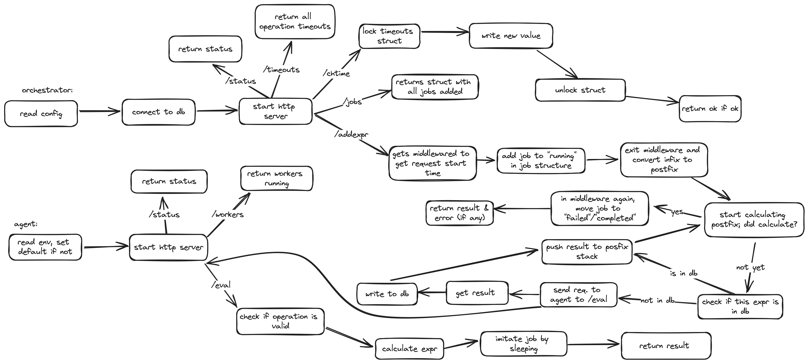

# rvav
Has 2 entities: agent and orchestrator. Orchestrator splits equations, agent calculates. By default orchestrator launches on :8080, agent on :8081

# Installation
```sh
git clone https://github.com/wdmvv/rvav
cd rvav
# building agent
cd agent
go get && go build
# building orchestrator
cd ../orchestrator
go get && go build
# you'll get 2 binaries - agent and orchestrator
# if you want gui-ish thing too
cd ../front && go build
# will give you front binary, launch it along others and open in browser
```
If you want, you can also launch it with database. In this case you have to set postgres up. If you dont want then set "usedb" in config to false<br>

After setting everything up, fill in /config/orchestrator.json with your data on everything<br>
To launch:
```sh
# cds everywhere because I did not setup absolute paths :^(
pwd # should say <some>/<path>/rvav

# first you need agent running, is on port 8001
cd agent && ./agent

# and then orchestrator, is on port 8000
cd orchestrator && ./orchestrator

# and frontend, is on port 7999
cd front && ./front

```
After that you can open your browser on http://127.0.0.1:7999 to see main page

# "How does this work?"


Close-ups:<br>
Orchestrator loop

Eval loop, i.e how does it calculate stuff

And agent


More detailed info on each:<br>
[For agent](/docs/agent.md)<br>
[For orchestrator](/docs/orch.md)<br>

